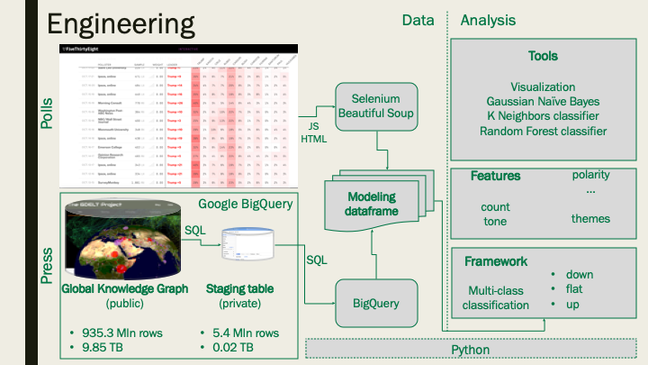
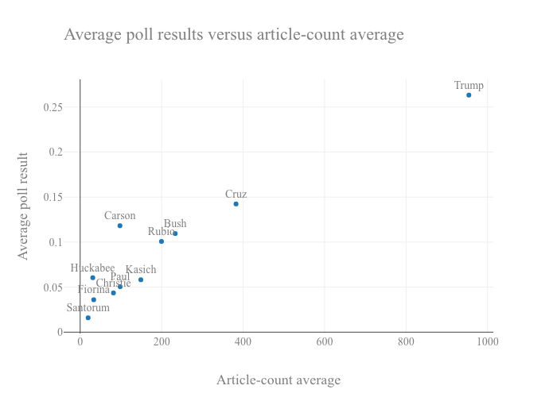
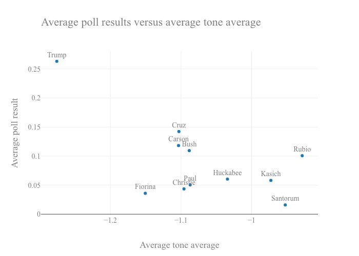

# Analyzing the relationship between press coverage and polling performance

### Stephen Godfrey, DSI-CC7-San Francisco

### Problem Statement

Explore and quantify the relationship between press coverage and polling performance.

### Executive Summary

Candidate polling is an important part of the political campaign process.  Poll results are closely watched by voters, journalists and, of course, candidates and their campaigns.  An increases in poll standings can help a campaign build momentum, solidy support and spur fundraising.  Decreases can have the opposite effects. Polls are particularly important in races with many candidates, as each participant struggles to differentiate from the pack.  Poll numbers can provide one metric by which candidates argue that they are achieving such differentiation.   As this is being written in May 2019, the U.S. is in the early stages of the 2020 presidential election and there are already some 20 Democratic candidates vying to earn their party's nomination and face the likely Republican nominee, Donald Trump.  Understanding poll drivers is of keen interest to these candidates, their supporters and opponents and to neutral observers.

One driver is media reporting and this analysis employs quantitative techniques to explore and model the relationship between press coverage and poll results.  To do so, I study the 2016 Republican presidential primary contest since it has similarities to today's Democratic race and might be a source of useful insights.  The approach is to build a data set that consists of poll results and key press-coverage metrics and themes from 2015 and 2016, a period in which the primary election process trimmed the a field consisting of many candidates down to one winner, Donald Trump.

The steps in the analysis are to use the data to make both qualitative and quantitative observations.  Quantitative observations are made by constructing models that use press coverage variables to predict future poll performance. 

### Engineering

Building the tools to construct and efficiently analyze the dataset was an important and challenging component to this project.  A summary of the tools built and employed in each major step is provided in the following table.  

|
 Analysis step  |
 Tools     |
|-----------------------------|---------------------------------------------|
|
1. Collect poll data| 
 Python objects were built that employ the [Selenium](https://www.seleniumhq.org/) and [Beautiful Soup](https://www.crummy.com/software/BeautifulSoup/bs4/doc/) APIs to scrape poll data from a specific FiveThirtyEight page.|
|
2. Collect press coveage data|
 Python objects were built that employ the Google [BigQuery](https://cloud.google.com/bigquery/) API to query the big data CKG V2 press article repository and write the results to a staging table for subsequent querying.  Additional objects and functions were developed to efficiently query this staging table and store the results in a pandas dataframe. |
|
3. Construct a modeling dataframe| 
 Objects from several common Python libraries were combined with custom Python functions to merge the poll and press data and create a dataframe suitable for addressing the problem statement.|
|
4. Examine the data|
 Python objects were built that employ the [Plotly](https://plot.ly/python/) graphing tools to create customized scatter plots and were used to visualize the data. |
|
5. Model the data| 
 Python objects were built that employ the [sklearn](https://scikit-learn.org/stable/) machine learning model set to create, fit and evaluate classification models.  These objects allow for automated application of several models over a variable feature set. |
|
6. Evaluate models| 
 Python objects were built that employ the [Plotly](https://plot.ly/python/) graphing tools to create a customized classification-model evaluation summary chart.  It automatically includes the ROC curve, accuracy score and confusion matrix.|

The chart below depicts this engineering process used in this analysis.

  

### Conclusions and Recommendations

Combining poll-result with press-coverage data allows for the creation of interesting visualization charts.  For example, the image below neatly aligns candidates along dimensions of poll performance versus press coverage and the visual alignment seems to match the intuition in which there is a positive relationship between poll performance and press coverage.  

The chart below shows the relationship between poll performance and GDELT's tone and provides one visual measure of Donald Trump's unique 2016 presidential campaign.

Using these data to create predictive models of future poll performance is more challenging.  In general, this analysis finds broad press metrics averaged across a wide candidate field provide little power in predicting performance in upcoming polls.   The accuracy of various classification models applied against a range of press metrics including article themes produced accuracy scores that were no better than the baseline.  

In this work, several model configurations were explored including predicting the performance in a future poll (in this case the third poll out) and limiting the data set to a single candidate.  These models exhibited improved accuracy and suggest that such approaches could yield results.   Future work could include extending this analysis to more campaigns notably the 2020 Democractic presidential primary, narrowing the press results to a smaller set of publications or geographies and continued refinement of in using individual or a full candidate field as the target variable.  

### Notebooks

* [Poll results](code/Poll_data_2016.ipynb)
* [Press coverage](code/Google_BigQuery.ipynb)
* [Data construction](code/Data_construction.ipynb)
* [Data modeling](code/Data_modeling.ipynb)

### Data

#### Data sources:

To conduct this analysis both polling press-coverage data are required.  These were collected from two different sources, [FiveThirtyEight](https://fivethirtyeight.com/) and the Global Data on Events, Language and Tone or [GDELT](https://www.gdeltproject.org/) project.  

FiveThirtyEight is a analytical service with a popular website that provides quantitative and statistical analysis of politics, sports, science and health, economics and culture.  For this project, polling data from the 2015/2016 Republican presidential primary were obtained from a specific FiveThirtyEight [page](https://projects.fivethirtyeight.com/election-2016/national-primary-polls/republican/). These data covered 670 polls between Jan 25, 2015 and May 3, 2016 and included results for 11 candidates (Donald Trump, John Kasich, Ted Cruz, Marco Rubio, Ben Carson, Jeb Bush, Chris Christie, Carly Fiorina, Rick Santorum, Rand Paul and Mike Huckabee).

GDELT is supported by Google Jigsaw and is a project thats monitors "the world's broadcast, print, and web news from nearly every corner of every country in over 100 languages and identifies the people, locations, organizations, themes, sources, emotions, counts, quotes, images and events driving our global society every second of every day, creating a free open platform for computing on the entire world." For this project, data were pulled from GDELT's Global Knowledge Graph Version 2 (GKG V2) database related the aforementioned candidates.  Specifically, the GDELT CKG values for tone, positive and negative scores, polarity and activity reference density and self reference density and a compilation of article themes were captured.  CKG V2 is a massive database at 9.85 terabytes (TB) with about 935.3 Mln rows.  For this application, relevant data were first extracted from CKG V2 and written to a staging table for subsequent queries.  This table is considerably smaller at 0.017 TB (17 GB) with 5.4 Mln rows.  

Details of the process used to acquire, clean and store data can be found in the [Poll results](code/Poll_data_2016.ipynb) and [Press coverage](code/Google_BigQuery.ipynb) notebooks available in the project GitHub repository.

 

#### Modeling data dictionary:

|Column        |Description    |
|-----------------|--------------------|
|end_time|  a date string correspondiong to a poll's end date|
|subject  | name of the subject of the press metrics|
|poll_result| the result for the subject in the poll ending on end_time|
|next_poll | a three-class classification variable for performance in the next poll (-1 = down, 0 = flat, 1 = up)|
|subject_end_time| a concatenation of subject and end date used for indexing|
|art_count  | the count of articles including the subject's name and within the time interval|
|word_count| the sum of the word counts of returned articles|
|tone_avg| the average of GDELT's tone measure for the returned articles|
|pos_score_avg  |the average of GDELT's positive score for the returned articles|
|neg_score_avg| the average of GDELT's negative score for the returned articles|
|polarity_avg| the average of GDELT's polarity measure for the returned articles|
|act_ref_den_avg  | the average of GDELT's active reference density measure for the returned articles|
|self_ref_den_avg|  the average of GDELT's self reference density measure for the returned articles|
|themes| a compilation of the themes for articles since the last poll (capped 2000)|

